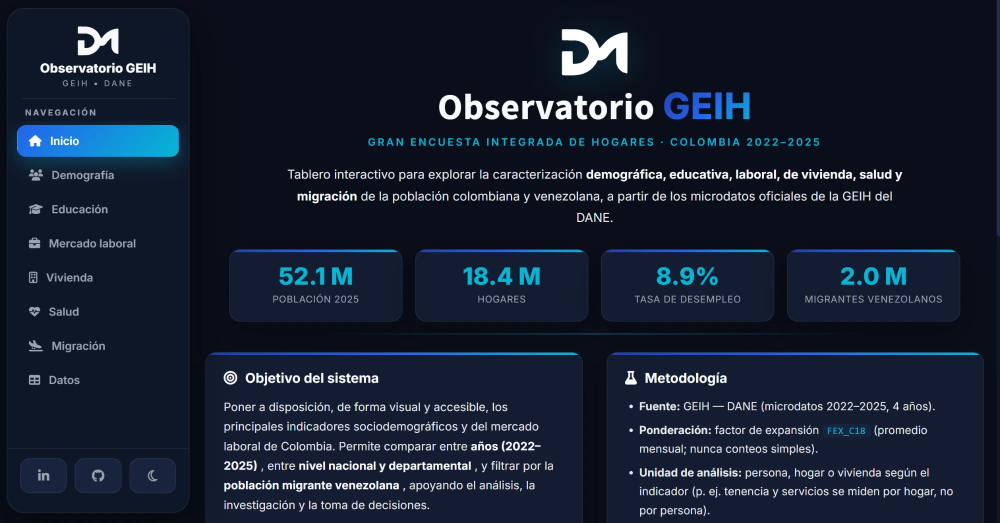
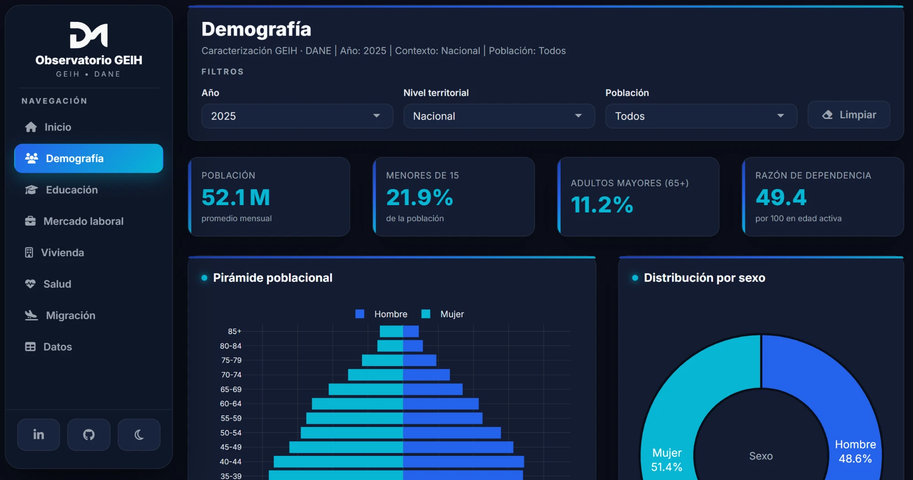
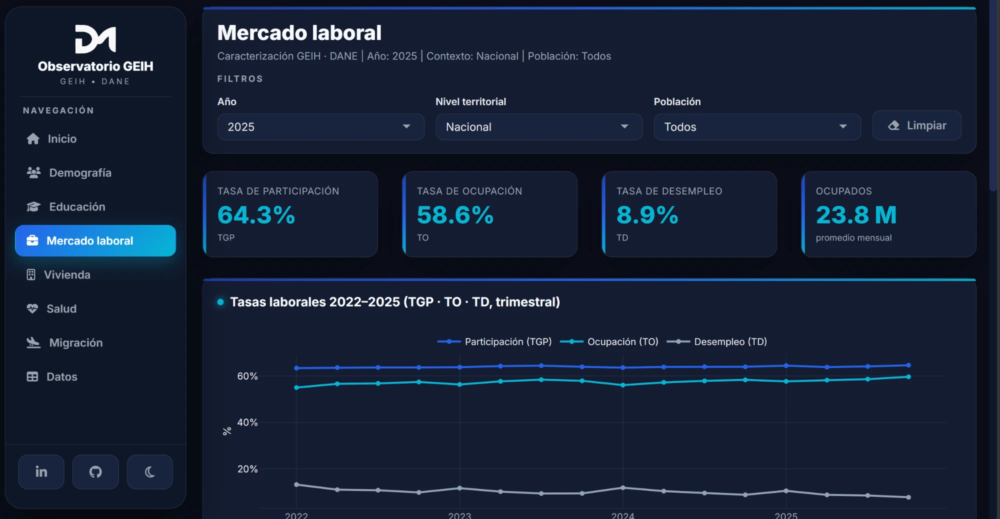

# Observatorio GEIH — Colombia 2022–2025

### Interactive Visualization and Analysis of Colombia's GEIH Data — A Shiny Application for Reproducible Demographic and Labor Market Research

[](https://www.r-project.org/)
[](https://shiny.posit.co/)
[](LICENSE)
[](https://jsidte-daniel-molina.shinyapps.io/shiny-app/)
[](https://doi.org/10.1007/978-3-032-18455-9_8)

Dashboard interactivo en **Shiny** para explorar la **Gran Encuesta Integrada de Hogares (GEIH)
2022–2025** del [DANE](https://www.dane.gov.co/), con caracterización de la población **colombiana
y venezolana** en demografía, educación, mercado laboral, vivienda, salud y migración, a nivel
**nacional y departamental**, con **eje temporal 2022–2025**.

> **🚀 App en vivo (v2, 2022–2025) →** [jsidte-daniel-molina.shinyapps.io/shiny-app](https://jsidte-daniel-molina.shinyapps.io/shiny-app/)
> **📄 Artículo publicado →** *Communications in Computer and Information Science*, Springer (R Day 2025, Medellín) · **[DOI](https://doi.org/10.1007/978-3-032-18455-9_8)**

> 🛠️ Desarrollado por **Daniel Molina Barrios**. El software es el artefacto de un artículo de
> investigación en co-autoría con Iván Cruz y Alic Barandica (ver [Cita](#-cita)).

---

## 📸 Capturas

| Hoja de inicio | Demografía |
|:---:|:---:|
|  |  |

**Mercado laboral**



---

## ✨ Funcionalidades

- **Hoja de inicio** institucional (objetivo, metodología, guía de uso).
- **7 dimensiones:** Demografía · Educación · Mercado laboral · Vivienda · Salud · Migración · Datos.
- **Eje temporal 2022–2025** con series de tendencia integradas (tasas laborales TGP·TO·TD y
  migración a nivel **trimestral**).
- **KPIs** destacados por sección (población, hogares, tasas, brecha salarial, analfabetismo, etc.).
- **Filtros dinámicos:** año · nivel territorial (nacional/departamental) · población (todos / migrante venezolana).
- **Enfoque migratorio:** caracterización de la población venezolana y sus motivos de migración.
- **Exportación:** tablas descargables en CSV y Excel.
- **Identidad visual de marca** "Premium Dark Tech" (tema oscuro, paleta azul→cian, tipografía Inter).
- **Optimizado para móvil y escritorio:** interfaz adaptable con menú, KPIs, tablas y gráficos
  pensados para cualquier tamaño de pantalla, con transiciones suaves.

## 📊 Datos

- **Fuente:** [GEIH 2022–2025](https://microdatos.dane.gov.co) — DANE, Colombia. Microdatos públicos.
- **Cobertura:** **4 años completos (2022, 2023, 2024, 2025)**, 12 meses cada uno.
- **`datos/geih_AAAA.csv`** (en `.gitignore`): microdatos consolidados por año (~2.5 GB). No se
  versionan (públicos y pesados); se descargan del DANE.
- **`agregados.rds`** (versionado, ~0.4 MB): tablas pre-agregadas que **consume la app**. Se
  generan offline con `preparacion/agregar.R`. Gracias a esto la app carga al instante y escala a
  los 4 años sin cargar microdato en memoria.

## 🧮 Metodología (resumen)

La app respeta la metodología oficial del DANE (`metodologia_geih/`):

- **Ponderación:** todo indicador poblacional se pondera por el factor de expansión `FEX_C18`;
  los conteos se expresan como **promedio mensual** (divisor = nº real de meses del periodo).
- **Unidad de análisis correcta por indicador:** persona, **hogar** o **vivienda**. Las variables
  de vivienda/hogar (tenencia, servicios, materiales, sanitario) se agregan **por hogar**
  (jefe de hogar), no por persona.
- **Tasas laborales** con las definiciones oficiales DANE: TGP = FT/PET, TO = OC/PET, TD = DS/FT.
- **Auditadas:** `tests/auditoria_valores.R` verifica que los agregados coincidan con el microdato
  y que los valores caigan en los rangos oficiales.

📘 **Detalle completo de cada indicador, su unidad y su cálculo en [`docs/INDICADORES.md`](docs/INDICADORES.md).**

## 🏗️ Arquitectura

```
datos/geih_2022..2025.csv   (microdatos por año, en .gitignore)
        │  preparacion/cargar_anios.R   (lee + selecciona + apila + añade ANIO)
        │  R/recodes.R                  (etiquetar_geih: códigos → etiquetas)
        │  R/indicadores.R              (cálculo por unidad correcta, ponderado)
        │  preparacion/agregar.R        (pre-agrega por año × geo × migrante)
        ▼
agregados.rds  ──►  app.R / global.R  ──►  modules/ (una pestaña cada uno)
   (~0.4 MB)         lee y filtra            R/plot_theme.R (tema de marca)
```

## 🔁 Reproducibilidad (rápida)

```r
# 1. Dependencias
install.packages(c("shiny","shinydashboard","plotly","data.table","DT","openxlsx","readxl"))

# 2. Descargar los 4 años de la GEIH del DANE -> datos/geih_2022.csv … geih_2025.csv

# 3. Regenerar los agregados (offline)
#    source de R/aggregate.R, R/recodes.R, R/indicadores.R, preparacion/cargar_anios.R
source("preparacion/agregar.R")     # -> escribe agregados.rds

# 4. Lanzar la app
shiny::runApp()
```

> Guía detallada en **[`docs/REPRODUCIBILITY.md`](docs/REPRODUCIBILITY.md)**.

## 🗂️ Estructura del repositorio

```
shiny-app/
├── app.R                     # UI + server (orquestación); pestañas modulares
├── global.R                  # Carga agregados.rds + capa R/ + módulos
├── agregados.rds             # Datos pre-agregados que consume la app (versionado)
├── R/                        # Lógica reutilizable
│   ├── aggregate.R           #   ponderación (FEX_C18, divisor de periodo)
│   ├── recodes.R             #   etiquetar_geih(): recodificación
│   ├── indicadores.R         #   indicadores por unidad (persona/hogar/vivienda)
│   ├── plot_theme.R          #   tema plotly de marca + paleta
│   └── helpers.R             #   KPIs, formato, gráficos de tendencia
├── modules/                  # Un módulo Shiny por pestaña
│   ├── mod_inicio.R          #   hoja de inicio (landing)
│   ├── mod_demografia.R  mod_educacion.R  mod_laboral.R
│   ├── mod_vivienda.R    mod_salud.R      mod_migracion.R  mod_datos.R
├── preparacion/              # Pipeline de datos (offline)
│   ├── cargar_anios.R        #   ingesta de los 4 años
│   ├── agregar.R             #   pre-agregación → agregados.rds
│   └── 01–04_*.R             #   validación (continuidad, resumen, diccionario, divisor)
├── tests/                    # Pruebas y auditoría (auditoria_valores.R, baselines)
├── www/                      # brand.css (tema) + logos
├── docs/                     # Documentación (ver índice abajo)
├── metodologia_geih/         # PDF metodológico oficial del DANE
├── datos/                    # microdatos 2022–2025  (en .gitignore)
├── LICENSE  ·  README.md  ·  .gitignore
```

## 📚 Documentación

| Documento | Contenido |
|---|---|
| [`docs/INDICADORES.md`](docs/INDICADORES.md) | Definición, unidad de análisis y cálculo de **cada indicador** (fuente oficial). |
| [`docs/REPRODUCIBILITY.md`](docs/REPRODUCIBILITY.md) | Cómo regenerar los datos paso a paso. |
| [`docs/ROADMAP.md`](docs/ROADMAP.md) | Plan por fases de la v2 (registro histórico). |
| [`docs/data_continuity.md`](docs/data_continuity.md) | Validación de continuidad de variables 2022–2025. |
| [`docs/SECURITY_TODO.md`](docs/SECURITY_TODO.md) | Pendiente de seguridad (rotación de token). |
| `docs/data-dictionary/` | Diccionario GEIH (`diccionario.xlsx`) y guías metodológicas. |

## 🛠️ Stack técnico

**R 4.5** · **Shiny** + **shinydashboard** · `plotly` · `data.table` · `DT` · `openxlsx` ·
`readxl` · desplegado en **shinyapps.io**.

## ☁️ Despliegue

La app está publicada en **shinyapps.io**. El procedimiento de despliegue paso a paso está en
[`docs/REPRODUCIBILITY.md`](docs/REPRODUCIBILITY.md).

## 📑 Cita

> Cruz, I., Molina, D., & Barandica, A. (2026). *Interactive Visualization and Analysis of Colombia's GEIH Data: A Shiny Application for Reproducible Demographic and Labor Market Research.* In **Communications in Computer and Information Science** (pp. 139–152). Springer, Cham. https://doi.org/10.1007/978-3-032-18455-9_8

<details><summary>BibTeX</summary>

```bibtex
@inproceedings{cruz2026geih,
  title     = {Interactive Visualization and Analysis of Colombia's GEIH Data: A Shiny Application for Reproducible Demographic and Labor Market Research},
  author    = {Cruz, Iv{\'a}n and Molina, Daniel and Barandica, Alic},
  booktitle = {Communications in Computer and Information Science},
  pages     = {139--152},
  year      = {2026},
  publisher = {Springer, Cham},
  doi       = {10.1007/978-3-032-18455-9_8}
}
```
</details>

## 🙌 Créditos

- **Desarrollo:** Daniel Molina Barrios.
- **Artículo (co-autoría):** Iván Cruz · Daniel Molina · Alic Barandica.
- **Datos:** DANE — Gran Encuesta Integrada de Hogares (GEIH).

## 📄 Licencia

Licencia **MIT** (ver [`LICENSE`](LICENSE)). Los microdatos de la GEIH son propiedad del **DANE** y
están sujetos a sus términos de uso.

## 👤 Autor

**Daniel Molina Barrios** — Economista & Data Scientist · Santa Marta, Colombia

[](https://github.com/dmetrics1)
[](https://www.linkedin.com/in/daniel-molina-b76a4323b/)
